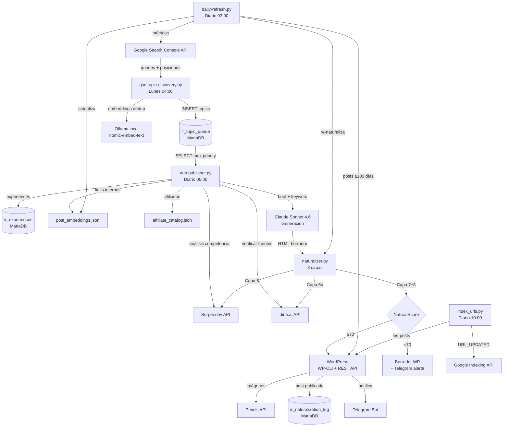

# AUDIT.md — inforeparto.com Content Pipeline
**Fecha:** 2026-04-05
**Auditor:** Claude Code (claude-sonnet-4-6)
**Alcance:** Todo el pipeline de generación autónoma de contenido SEO

---

## 1. MAPA DE ARCHIVOS Y FUNCIÓN

```
/home/devops/projects/inforeparto/
│
├── scripts/                          # Procesos cron principales
│   ├── autopublisher.py              # [CRON 05:00] Generación diaria de posts nuevos
│   ├── daily-refresh.py              # [CRON 03:00] Re-naturalización de posts antiguos
│   ├── gsc-topic-discovery.py        # [CRON 04:00 lun] Descubre temas desde GSC
│   ├── affiliate_catalog.json        # Catálogo de productos Amazon con ASINs
│   ├── post_embeddings.json          # Caché de embeddings de posts publicados (Ollama)
│   └── logs/                         # Logs diarios por script
│
├── gsc-indexing/
│   └── index_urls.py                 # [CRON 10:00] Notifica indexación a Google API
│
├── naturalizer/                      # Motor de naturalización v4
│   ├── naturalizer.py                # Motor principal: 8 capas de humanización + NaturalScorer
│   ├── author_schema.py              # Capa 6b: byline de autor + JSON-LD schema
│   ├── competitor.py                 # Capa 6: análisis competitivo (Serper)
│   ├── sources.py                    # Capa 5b: inyector de fuentes verificadas (Jina)
│   ├── experience_db.py              # Capa 4: base de datos de experiencias de repartidores
│   │
│   ├── config/                       # Configuración global del motor
│   │   ├── settings.yaml             # Thresholds, modelos, retries, score mínimo
│   │   ├── patterns_es.yaml          # Patrones IA a eliminar, malas aperturas
│   │   └── expresiones_es.yaml       # Expresiones naturales para inyectar
│   │
│   ├── contextos/inforeparto/        # Configuración específica del sitio
│   │   ├── editorial_rules.yaml      # Temas prohibidos, disclaimers, red flags, estructura
│   │   └── voz.md                    # Perfil de voz editorial (Markdown con frontmatter YAML)
│   │
│   └── scripts/                      # Scripts de mantenimiento (no en cron)
│       ├── seed_experiences.py       # Rellena experience_db con datos iniciales
│       ├── migrate_db.py             # Migraciones de schema MariaDB
│       └── update_metrics.py         # Actualiza métricas GSC en ir_naturalization_log
│
└── gsc-indexing/
    └── index_urls.py                 # Indexing API de Google
```

**Base de datos MariaDB (wordpress_db):**
- `wp_posts`, `wp_postmeta` — WordPress estándar
- `ir_topic_queue` — Cola de temas con prioridad y estado de procesado
- `ir_naturalization_log` — Log de posts generados/naturalizados con métricas GSC
- `ir_experiences` — Experiencias reales de repartidores (Capa 4)

**Meta WP especial:**
- `_ir_autopublished = 1` — Marca posts de la serie del autopublisher (el calendario de publicación solo rastrea estos)

---

## 2. DIAGRAMA DE FLUJO DE DATOS



---

## 3. DEPENDENCIAS REALES (requirements.txt)

Instaladas y usadas actualmente en el pipeline:

```
# LLM
anthropic>=0.40.0

# Base de datos
mysql-connector-python>=8.0.0

# HTTP
requests>=2.31.0

# Configuración
PyYAML>=6.0

# Google APIs
google-auth>=2.25.0
google-auth-httplib2>=0.2.0

# (Dependencias de stdlib — no requieren instalación)
# argparse, json, logging, math, os, random, re, subprocess, sys,
# datetime, pathlib, typing, hashlib, time, uuid, difflib, tempfile
```

**No instaladas pero en el blog-generator (legacy, ya no activo):**
- openai, google-genai, python-dotenv, click, rich, pandas, flask, etc.

---

## 4. PROBLEMAS ENCONTRADOS (por severidad)

---

### 🔴 CRÍTICO — Credenciales hardcodeadas en código

**C-1. Contraseña de MariaDB en 4 archivos**

| Archivo | Línea |
|---------|-------|
| `scripts/autopublisher.py` | 64 |
| `scripts/daily-refresh.py` | 51 |
| `scripts/gsc-topic-discovery.py` | 35 |
| `naturalizer/naturalizer.py` | ~50 (DB_CONFIGS dict) |

Valor: `password="2R9EUs4FDYlc"`
Impacto: cualquier acceso al repo expone la contraseña de BD.
Fix: mover a `~/.env.projects` como `WP_DB_PASSWORD=...` y leer con `os.environ.get()`.

**C-2. Token del bot de Telegram hardcodeado en 3 archivos**

| Archivo | Línea |
|---------|-------|
| `scripts/autopublisher.py` | 66–67 |
| `scripts/daily-refresh.py` | 71–72 |
| `scripts/gsc-topic-discovery.py` | 37–38 |

Valor: `"8558131550:AAF4lUqNljBn3AXclat_q7VxaBT0u8DFuhI"`
Fix: `TELEGRAM_BOT_TOKEN = os.environ.get("IR_TELEGRAM_BOT_TOKEN", "")`.

---

### 🟠 ALTO — Inconsistencias de logging

**A-1. gsc-topic-discovery.py usa print() — no logging**

Todos los mensajes son `print()` sin timestamp ni nivel. No se guardan en log file.
Fix: añadir `logging.basicConfig()` igual que en `autopublisher.py`.

**A-2. index_urls.py usa print() con emojis**

Mismo problema. El script no tiene fichero de log.
Fix: mismo patrón de logging con FileHandler.

**A-3. competitor.py y sources.py no tienen logging**

Errores en estos módulos se silencian. Si Serper o Jina fallan, no queda traza.

---

### 🟠 ALTO — Dos patrones distintos de conexión a BD

**A-4. Scripts usan dict hardcodeado; naturalizer usa `_get_db_config(site)`**

Los scripts definen `DB = dict(host=..., password=...)` de forma estática.
El naturalizer tiene `_get_db_config(site)` que lee `wp-config.php` como fallback.

El patrón de `_get_db_config()` es superior: admite fallback, no expone credenciales.
Fix: los scripts deberían usar el mismo helper.

---

### 🟠 ALTO — Sin validación de variables de entorno al arrancar

**A-5. Si falta ANTHROPIC_API_KEY, SERPER_API_KEY, JINA_API_KEY o PEXELS_API_KEY, el script arranca, falla más tarde y el error es críptico.**

Fix: añadir bloque de validación al inicio de `main()`:
```python
REQUIRED_ENV = ["ANTHROPIC_API_KEY", "SERPER_API_KEY", "PEXELS_API_KEY"]
missing = [k for k in REQUIRED_ENV if not os.environ.get(k)]
if missing:
    log.error(f"Variables de entorno requeridas no definidas: {missing}")
    sys.exit(1)
```

---

### 🟡 MEDIO — Referencias hardcodeadas a "inforeparto"

**M-1. index_urls.py línea 52:** URL hardcodeada `https://inforeparto.com/{slug}/` — si se reutiliza para psicoprotego, falla.

**M-2. autopublisher.py líneas 60-62:** `WP_PATH`, `WP_URL`, `SITE` como constantes de módulo. Para un segundo sitio habría que copiar y editar el archivo entero.

**M-3. author_schema.py:** Tiene `AUTHOR_CONFIG` dict con ambos sitios — este es el **patrón correcto** que los demás deberían seguir.

---

### 🟡 MEDIO — Silenciamiento amplio de excepciones

**M-4. Múltiples `except Exception: pass` o `except Exception as e: log.warning(...)`**

En Capas 4, 5b, 6 del pipeline: si la capa falla, el post continúa sin esa información pero sin aviso claro. Esto es correcto en principio (degradación graciosa), pero debería distinguir entre errores recuperables (timeout de API) e irrecuperables (bug de código).

---

### 🟡 MEDIO — Indexación GSC no integrada con autopublisher

**M-5. index_urls.py filtra `post_status='publish'`**

Los posts del autopublisher se quedan en estado `future` hasta su fecha. El script de indexación diaria a las 10:00 **nunca los ve**. Google no recibe la notificación al publicarse.

Fix: llamar a `index_urls.py --post-id {wp_post_id}` desde `autopublisher.py` justo después de crear el post.

---

### 🟡 MEDIO — ExperienceDB no se alimenta automáticamente

**M-6.** Las experiencias de repartidores (`ir_experiences`) son datos estáticos cargados con `seed_experiences.py`. No hay pipeline automático para enriquecerlos (scraping de foros, Reddit, reviews).

---

### 🟢 BAJO — Archivos de configuración nombrados inconsistentemente

**B-1.** Los archivos de configuración global están en `naturalizer/config/` con nombres `patterns_es.yaml` y `expresiones_es.yaml`, pero el código en `naturalizer.py` los referencia como `patterns` y `expresiones` (sin `_es`). El nombre del idioma en el nombre del archivo no aporta nada actualmente.

**B-2.** La voz editorial está en `voz.md` (Markdown) mientras que editorial_rules está en `editorial_rules.yaml`. Formatos distintos para configuración del mismo nivel.

---

### 🟢 BAJO — requirements.txt inexistente en el proyecto activo

El único `requirements.txt` encontrado es del `blog-generator` (legacy, inactivo). El pipeline activo no tiene sus dependencias declaradas. Instalar en un servidor nuevo requeriría deducir las dependencias a mano.

---

### 🟢 BAJO — math importado innecesariamente en daily-refresh.py

`import math` en línea 23 de `daily-refresh.py` — revisar si se usa (posible import residual de una versión anterior del NaturalScorer).

---

## 5. RESUMEN EJECUTIVO

| Categoría | Problemas | Acción |
|-----------|-----------|--------|
| 🔴 Credenciales expuestas | 2 (en 7 archivos) | Mover a `.env.projects` inmediatamente |
| 🟠 Logging inconsistente | 3 scripts sin logging | Estandarizar patrón autopublisher |
| 🟠 Patrón BD duplicado | 2 patrones distintos | Consolidar en `_get_db_config()` |
| 🟠 Sin validación env | Todos los scripts | Añadir bloque de validación al arranque |
| 🟡 Hardcoding sitio | 3 referencias | Usar variable de entorno `SITE` |
| 🟡 GSC indexing desconectado | 1 gap crítico | Integrar llamada en autopublisher |
| 🟢 requirements.txt | Ausente | Crear en `/scripts/` y `/naturalizer/` |

**Estado general:** El pipeline funciona en producción y los flujos principales están correctos. Los problemas críticos son de seguridad operacional (credenciales en código), no de lógica. El gap de indexación GSC es el único que afecta directamente al rendimiento SEO.
